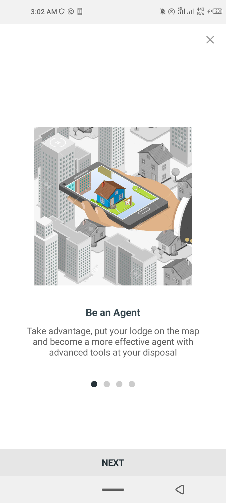
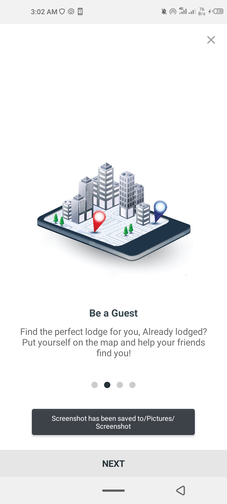
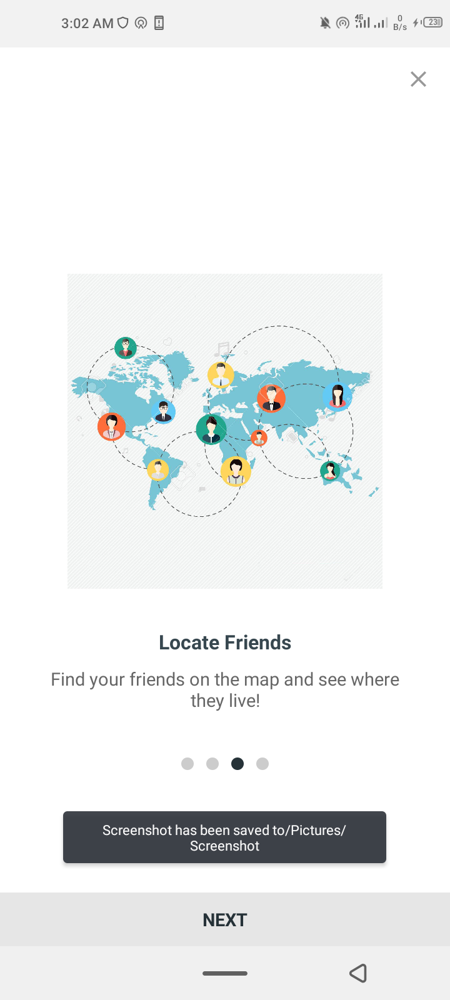
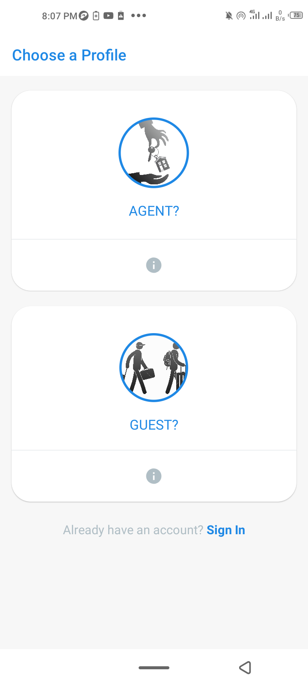
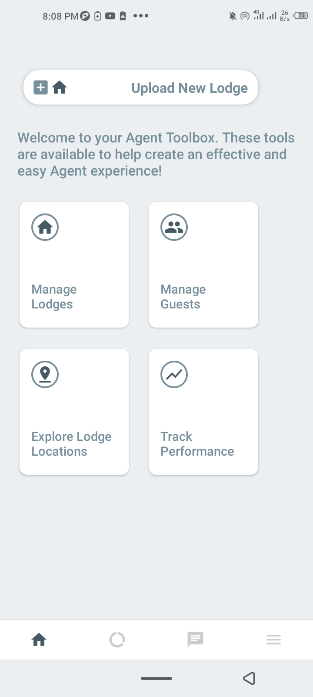

# A Property Listing Application 

**This is an ongoing android project written in java with firebase and firestore as the backend.** 

The goal is to have agent/guest user types who can respectively create and access vacancies as notifications on the map(Google map Api). Firebase is being used for the login/logout and email verification system, while Firestore is being used as the Storge backend.

**Sample Screenshot:**

**Application:**
[Debug apk version](app-debug.apk)

**Features:**

*  [x] SignUp as Agent  
*  [x] SignUp as Guest 
*  [x] Sign In/ SignUp  
*  [x] Agent Dashboard
    * [x] Front-end
    * [] Backend
*  [] Guest Dashboard
    * [x] Front-end
    * [] Backend
*  [] Firebase Notifications   
*  [] Google Maps
    * get automatic location updates
    * search for locations
    * see notification update as map popups
* []  Online Payment System.
* and more.
